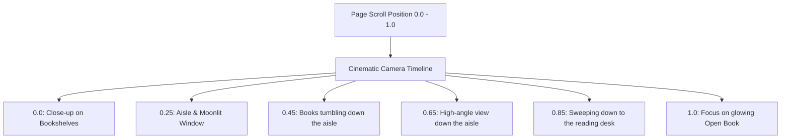

# 🚀 LinkShelf — Official Launch Website

> *"Your reading list, decaying in real time."*

This repository contains the official, highly immersive **launch and marketing website** for **LinkShelf** — a cross-device read-later application designed with mathematical decay curves to fight digital hoarding and inbox fatigue. 

The website serves as the interactive gateway to the LinkShelf ecosystem, featuring a fully scroll-linked 3D realistic library ecosystem, interactive decay simulators, and a live software distribution dashboard.

---

## ✦ The Immersive 3D Background Ecosystem

The core visual highlight of the website is the realistic, scroll-controlled 3D library background built on **WebGL**, **Three.js**, and **React Three Fiber**. As users scroll, the scene dynamically tells a visual story of decay and preservation.



### 1. Cinematic Realistic Camera Timeline
A frame-by-frame interpolation system maps the user's scroll progression to the WebGL camera coordinates and lighting states:
* **Keyframed Pathing**: The camera pans, rotates, and zooms down the library aisle, starting from the books on the shelves and ending at the reading table.
* **Lighting Interpolation**: The key light (cool blue moonlight) and fill light (warm tungsten lamp glow) interpolate their intensities, colors, and shadow bounds in sync with the scroll keyframes.
* **Dynamic Mouse Parallax**: Subtle pointer tracking offsets the camera and applies a natural roll based on horizontal mouse movement for a tangible sense of depth.

### 2. High-Fidelity Geometry & Furniture
The 3D canvas represents a detailed reading sanctuary:
* **The Reading Nook**: A custom wood-grained library table holding a traditional green **Bankers Lamp** (with active point lighting), a **Quill Pen & Brass Inkwell** containing dark ink, a cozy area rug, and a classic spindle-back chair.
* **The Glowing Open Book**: Placed on the table, it emits a soft emerald-green light representing active knowledge, complete with text line meshes and floating emissive nodes.
* **Procedural Wooden Textures**: Walnut grain textures are procedurally generated on HTML5 canvas elements during startup and cached as WebGL textures, eliminating the need to download heavy texture files.

### 3. Volumetric Moonlight & Glistening Particles
* **Volumetric Light Shader**: A custom cylinder geometry with custom vertex and fragment shaders simulates moonlight god rays streaming through the grand arched window.
* **Responsive Dust Particles**: An instanced particle array of 200 elements drifts ambiently. When a particle enters the volumetric light ray, it glistens: scaling up, increasing opacity, and shifting color from warm tungsten to glistening moonlit blue.

---

## ✦ Key Marketing & Landing Features

### 1. Interactive Freshness Engine Simulator
In the **Freshness Engine** section, users can interact with a live mockup of decaying links:
* **Scroll-Linked Decay**: The links visually rot as you scroll down the page, shifting from a fresh Emerald Green through Amber Yellow and Burning Orange down to a critical Crimson Red.
* **Urgency Indicator Bands**: Emulates the actual app's mathematical thresholds:
  * `> 0.80` **Fresh** (🟢 Emerald Green) — Actionable
  * `0.50 – 0.80` **Fading** (🟡 Amber Yellow) — Attention needed
  * `0.25 – 0.50` **Stale** (🟠 Burning Orange) — Expiring soon
  * `< 0.25` **Critical** (🔴 Crimson Red) — Near rot

### 2. Dynamic Distribution Dashboard
The **Get LinkShelf** dashboard serves as a live hub for downloading native client applications:
* **GitHub API Integration**: Real-time fetching of release statistics, downloading URLs, file sizes, and release dates directly from the repository.
* **Platform Tabs**: Clean, interactive navigation between **macOS (Universal ZIP)**, **iOS (TestFlight)**, **Android (AAB/APK)**, and **Chrome/Edge Extension**.
* **Interactive Terminal Changelog**: A simulated CLI command (`cat changelog_platform.log`) types out recent git commit logs dynamically when switching platforms.
* **Cryptographic Verification**: Securely lists SHA-256 hashes for build validation with one-click copy to clipboard.

---

## ✦ Architecture & Technology Stack

The launch site is built with premium performance, accessibility, and high visual excellence in mind:

* **Core Framework**: [Next.js 16](https://nextjs.org/) & React 19 (App Router)
* **3D Engine**: [Three.js](https://threejs.org/) powered by `@react-three/fiber` & `@react-three/drei`
* **WebGL Post-Processing**: `@react-three/postprocessing` rendering high-trust **Bloom** (glowing nodes) and **N8AO** (realistic ambient contact shadows inside bookshelves)
* **Styling & Layout**: [Tailwind CSS v4](https://tailwindcss.com/) with native PostCSS imports
* **Scroll & Animation**: [Lenis](https://lenis.darkroom.engineering/) for smooth scroll interpolation, [Framer Motion](https://www.framer.com/motion/) for micro-interactions, and [GSAP](https://gsap.com/) for page animations.

### Performance Optimizations
To maintain buttery-smooth **60fps hardware-accelerated animations** across all viewports:
* **Instanced Mesh Rendering**: Static books in the background bookshelves are grouped by color and rendered via `THREE.InstancedMesh` to draw hundreds of items in a single GPU draw call.
* **Mobile Adaptability**: The page automatically detects mobile screens to:
  * Disable heavy antialiasing and sub-pixel scale devices.
  * Adjust the camera Field of View (FOV) from `50` to `68` to fit the viewport.
  * Reduce shadow map resolution from `1024x1024` to `512x512` and disable N8AO ambient occlusion passes.
  * Filter out and skip rendering off-screen bookshelves.

---

## ✦ Local Development

To run this launch website locally on your system:

### 1. Prerequisites
Ensure you have [Node.js](https://nodejs.org/) (v18.x or later) and npm installed.

### 2. Setup
Clone the repository and install the dependencies:
```bash
npm install
```

### 3. Development Server
Start the Next.js development server:
```bash
npm run dev
```
Open [http://localhost:3000](http://localhost:3000) in your browser to inspect the application.

### 4. Build Optimization
To build the optimized production package:
```bash
npm run build
npm run start
```
